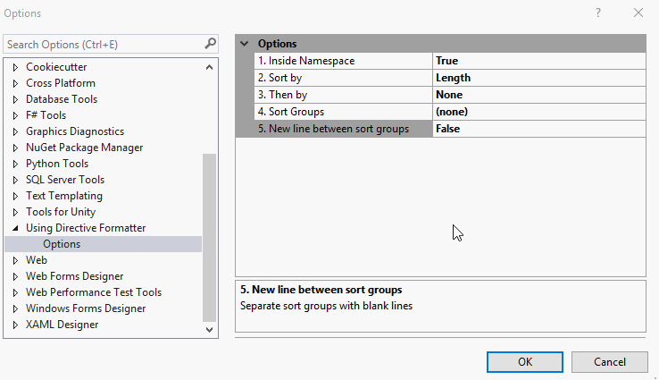

# Using Directive Formatter
- Formats using namespace directives for C# codes
	- Can be configured to automatically format on Save
- The using directives will be placed inside or outside the namespace declaration, depending on user configuration
- Order using directives by length or alphabetically, so that they appear in order
- Supports order chaining
- Supports grouping of using directives. Sorting happens within groups in this case.
- Currently supported versions: Visual Studio 2022
# Download

Published and available for download at https://marketplace.visualstudio.com/items?itemName=GregaMohorko.MohorkoGUsingDirectiveFormatter

# Demo
The demo below shows both a working demo, and a screenshot of options available for the extension

